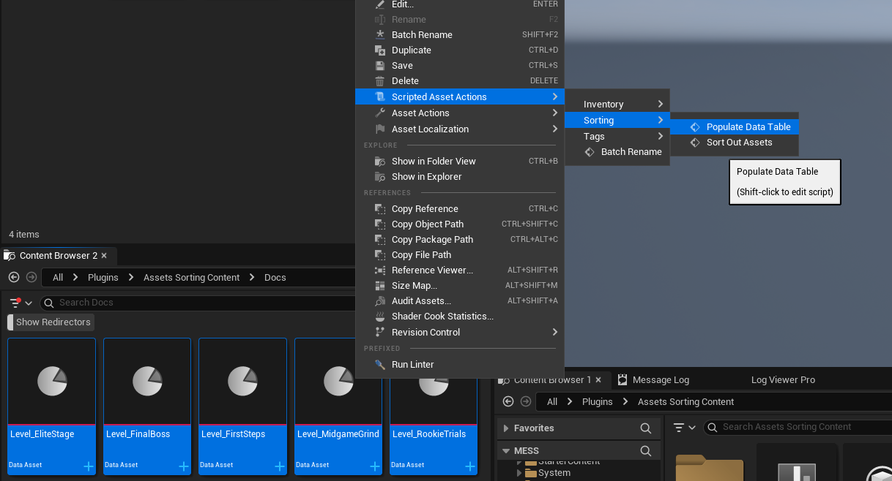
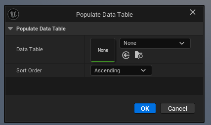
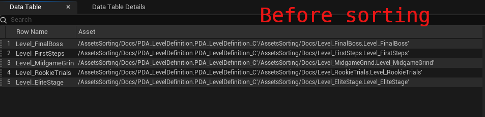
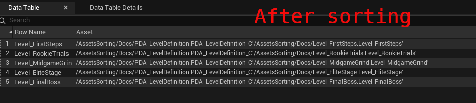
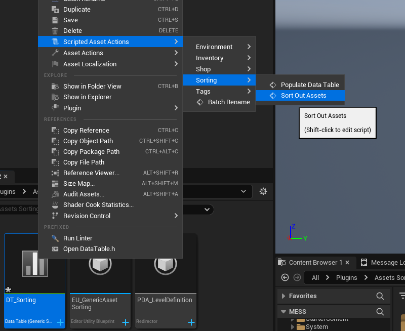
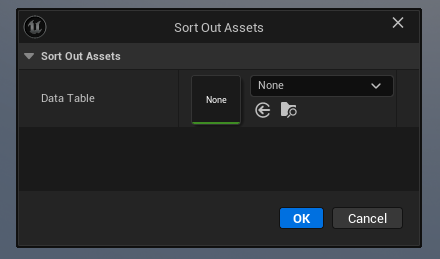
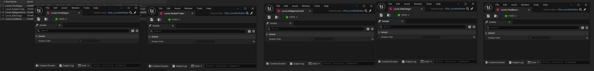
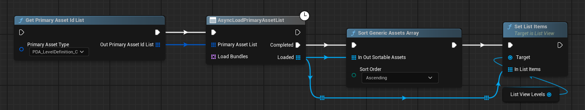

# Generic Asset Sorting Utility

General purpose sorting asset utility action to sort out primary data assets

## Installation

Clone the repository in your project's Plugin directory.

## Functionality

When dealing with PDA and loading, their order isn't consistent. If you're dealing with some UI like a set level selection, you might want to put the starting levels at the beginning, and the final levels at the end. That's where the plugin helps out to deal with that problem.

To support generic sorting, your PDA must have an integer like DisplayOrder or DisplayPriority depending on your ordering preferences (ascending or descending respectively), implement IGenericSortableAsset interface and its functions.

A C++ implementation would look like this (BP are supported as well):

```cpp
UCLASS()
class UMyLevelDefinition
	: public UPrimaryDataAsset
	, public IGenericSortableAsset
{
	GENERATED_BODY()

	//~IGenericSortableAsset Interface
	virtual int32 GetSortingPriority_Implementation() const override
	{
		return DisplayOrder;
	}

	virtual void SetSortingPriority_Implementation(int32 InSortingPriority) override
	{
		DisplayOrder = InSortingPriority;
	}
	//~End of IGenericSortableAsset Interface

public:
	UPROPERTY(VisibleAnywhere, BlueprintReadOnly)
	int32 DisplayOrder = 0;

	// Other relevant things to a level...
};
```

Once you have your PDA and a few instances in the editor, you can deal with actual sorting.

Select all the PDA's that you want to sort, right click one of them, go to Scripted Asset Action -> Sorting -> Populate Data Table.



You can specify the intermediate data table you will sort out your items in, or leave it empty to use the pre-existing data table in the plugin Content directory (Plugins/AssetsSorting/DT_Sorting).

Note that having an isolated DT's for a set of assets would make the process quicker since you wouldn't need to load the assets anymore (unless you add new ones).



After applying, open up the data table (if it was open, close it, as the engine doesn't flush the DT contents when adding/removing rows outside the UI). 

You will see the elements sorted the way they currently are. You can move them around to order them as you wish.

You can either move the elements manually, or export the DT to a CSV, edit it elsewhere, and import it back.



<br>



Once you've finished ordering the assets in the DT, you have to bake the results to the PDA's, so that your UI code can use them accordingly.

Right click the DT or any PDA, and go to Scripted Asset Action -> Sorting -> Sort Out Assets. Now you'll see that the DisplayOrder in the PDA's have changed accordingly to the DT ordering.



<br>



<br>



The plugin also comes with a utility to sort out an array of assets that implemented that interface.


